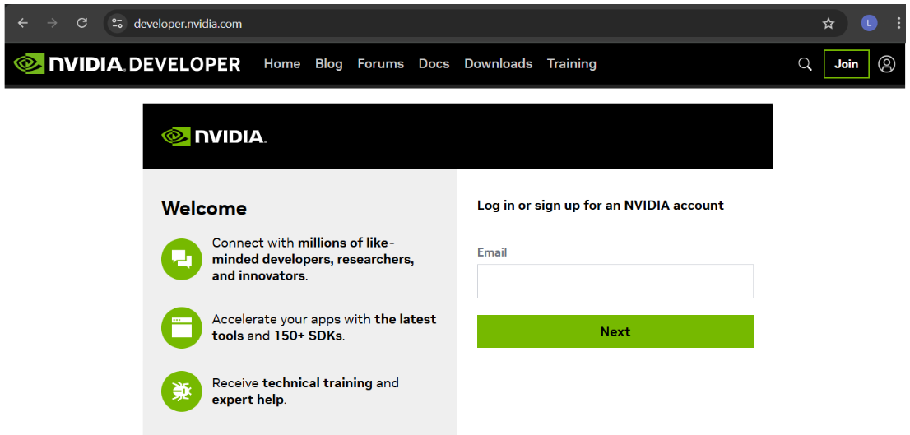
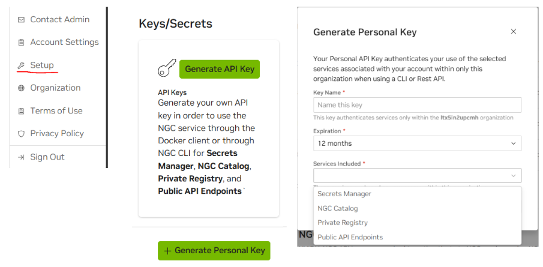

# Development Workstation

## MobaXterm Home Edition

(For managing KVM)

https://mobaxterm.mobatek.net/download.html

## Visual Studio Code

(For modifying application code)

https://code.visualstudio.com/download

Extensions:

	• Remote Development

## NVIDIA Developer Account

(For API access to NIMs)

If you don't already have one, signup for a developer account at developer.nvidia.com

Once account is created, navigate to ngc.nvidia.com

(You may have to login again with the account you just created)

Generate an API key under 'Setup' from the user drop down in the upper right corner

Save your key so you can reference it later - you will not see the value again
